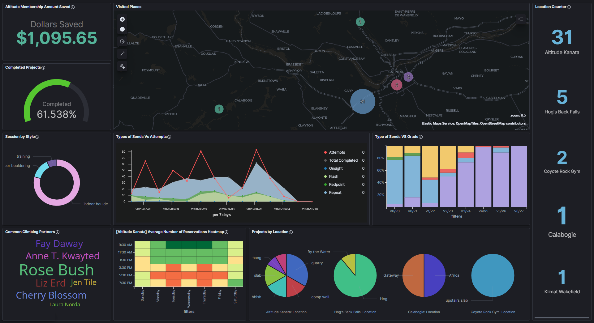

[![build][workflow-shield]][workflow-url]
[![Contributors][contributors-shield]][contributors-url]
[![Forks][forks-shield]][forks-url]
[![Stargazers][stars-shield]][stars-url]
[![Issues][issues-shield]][issues-url]
[![LinkedIn][linkedin-shield]][linkedin-url]

<br />
<p align="center">
  <h1 align="center">Climbr</h1>
  <a>
    
  </a>
  <p align="center">
    Visualize your rock climbing progression and trends. 
    <br />
    <a href="https://www.peterqlam.com/projects/#climbr"> Website</a>
    ·
    <a href="https://www.peterqlam.com/projects/#climbr"> Screenshots </a>
    ·
    <a href="https://github.com/Peter-Lam/climbr/wiki">Wiki</a>
    ·
    <a href="https://github.com/Peter-Lam/climbr/issues">Report Bug</a>
    ·
    <a href="https://github.com/Peter-Lam/climbr/issues">Request Feature</a>
  </p>
</p>

# About

**`Climbr`** is a utility that allows users to visualize and highlight their climbing strengths, weaknesses, and trends. From professionals to beginners, trad climbers to indoor boulderers, users can log climbing sessions from a selection of templates and instantly view their trends, patterns, and statistics with pre-configured Kibana dashboards.

In addition, **`Climbr`** provides booking insights on local gyms (Altitude Kanata, Altitude Gatineau, Coyote Rock Gym), to help users find the most optimal climbing time according to location, time of day, and time of week. Climbers can utilize this information to make socially responsible decisions. Those looking to minimize their risk whilst still staying active can easily find the off-peak hours of their local gym. 

## Technologies

<p float="left">
  <a href="https://www.python.org/">
    
  </a>
  <a href="https://www.docker.com/">
  
  </a>
  <a href="https://www.elastic.co/">
  
  </a>
  <a href="https://www.elastic.co/kibana">
  
  </a>
</p>

## Contributors

### Peter Lam
  - [Website](https://www.peterqlam.com/)
  - [Linkedin](https://www.linkedin.com/in/peter-lam-612a00138/)
  - [Resume](https://www.peterqlam.com/s/Peter-Lam-Resume.pdf)

# Features

## 1. Log your climbing sessions and projects

## 2. Visualize climbing trends with dashboards

- Use data to influence your training regime and pinpoint weaknesses
- Make responsible decisions based on booking data

### Climbing Stats and Metrics

<a>
  
</a>

  - Map of visited locations
  - Most common climbing discipline (Lead, Bouldering, Trad)
  - Grade counter

### Climbing Trends and Progression

<a>
  
</a>

  - Progression in grades over time
  - What's your flash grade? project grade?
  - Strongest/Weakest climbing style? What areas should I improve?

### Bookings

<a>
  
</a>

  - Busiest time to climb
  - Best time to climb to avoid crowds
  - Average bookings based on gym

# Host Requirements

- [Docker 19+](https://www.docker.com/products/docker-desktop)

# Quick Start

1. Open Command Prompt/Terminal
2. Change directories to this the root of this repository
3. Build and start up ElasticSearch, Kibana, and Climbr containers with:
    ```shell
    docker-compose up -d --build
    ```
    **Note:** By defualt, the webscraper is disabled, to enable run `docker-compose up -d --build --profile webscraper` instead
4. Confirm that all containers are running
    - Run `docker ps`, the containers *climbr_cli*, *climbr_kibana*, and *climbr_es* should be running
    - You should be able to establish a connection to http://localhost:5601
    - If the link is not reachable, wait a couple minutes and try again
5. Run the demo visualizations and data
      2. Run the following command to initialize the demo
          ```shell
          docker exec -d climbr_cli poetry run cli demo
          ```
6. View Climbr visualizations at: http://localhost:5601/

# Getting Started

Please visit the [wiki](https://github.com/Peter-Lam/climbr/wiki) for more information regarding system requirements, set-up, and usage.


[contributors-shield]: https://img.shields.io/github/contributors/peter-lam/climbr.svg?style=flat-square
[contributors-url]: https://github.com/peter-lam/climbr/graphs/contributors
[forks-shield]: https://img.shields.io/github/forks/peter-lam/climbr.svg?style=flat-square
[forks-url]: https://github.com/peter-lam/climbr/network/members
[stars-shield]: https://img.shields.io/github/stars/peter-lam/climbr.svg?style=flat-square
[stars-url]: https://github.com/peter-lam/climbr/stargazers
[issues-shield]: https://img.shields.io/github/issues/peter-lam/climbr.svg?style=flat-square
[issues-url]: https://github.com/peter-lam/climbr/issues
[license-shield]: https://img.shields.io/github/license/peter-lam/climbr/.svg?style=flat-square
[linkedin-shield]: https://img.shields.io/badge/-LinkedIn-black.svg?style=flat-square&logo=linkedin&colorB=555
[linkedin-url]: https://www.linkedin.com/in/peter-lam-612a00138/
[workflow-shield]: https://img.shields.io/github/workflow/status/peter-lam/climbr/Nox%20Tests/master
[workflow-url]: https://github.com/Peter-Lam/climbr/actions
